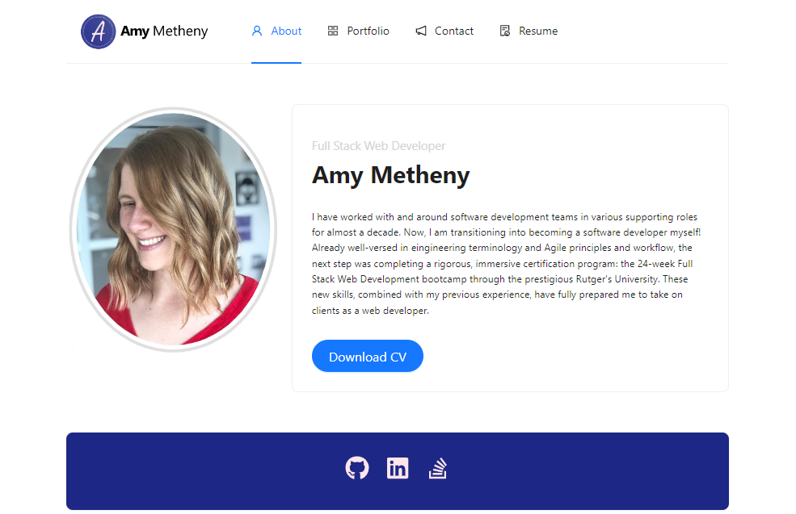
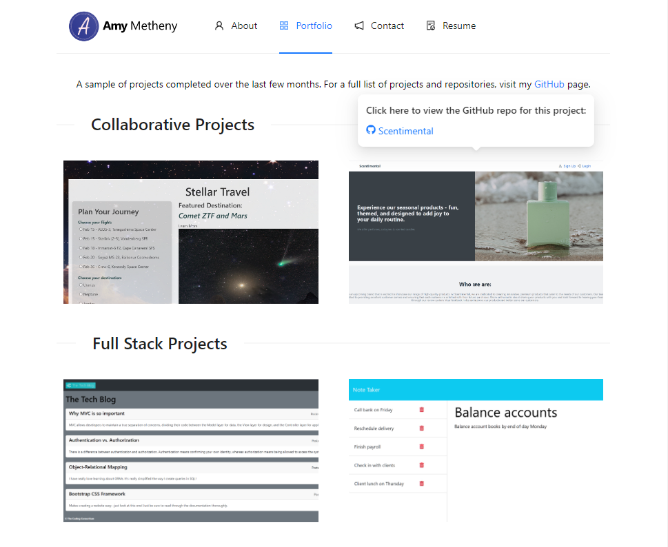
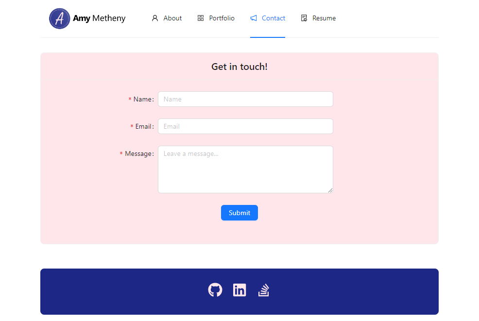
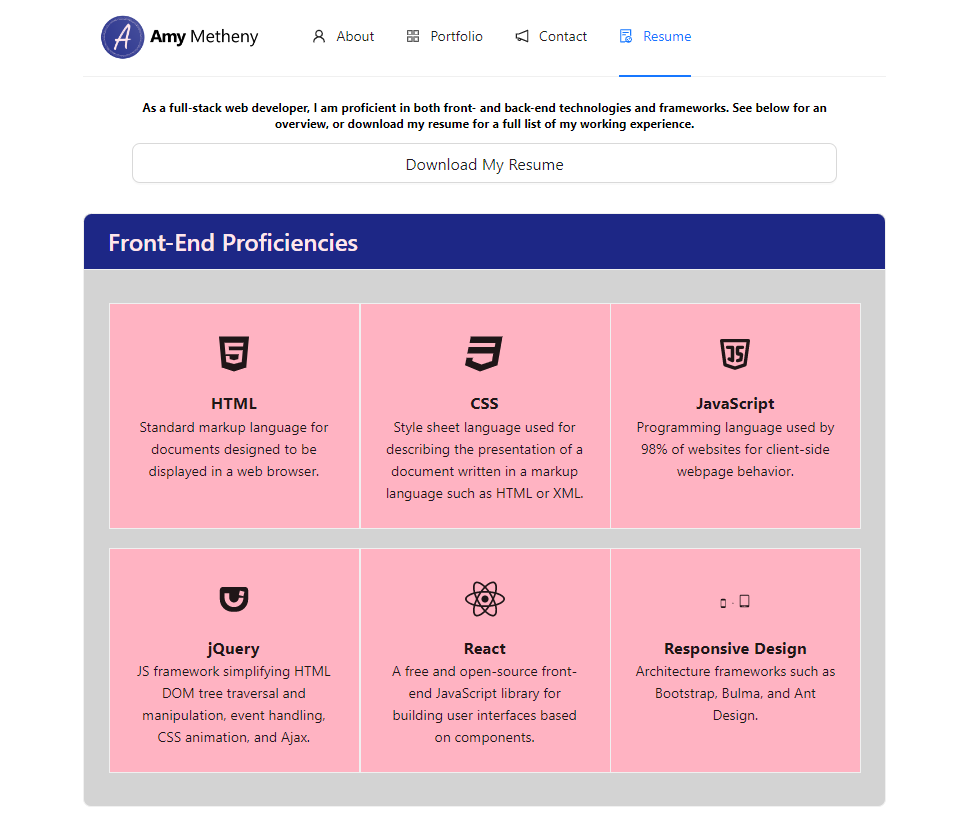

# react-portfolio
Web developer showcase for previous work using React to create a single-page portfolio application.

## Link to Deployed App
[Amy Metheny React Portfolio](https://abmetheny.github.io/react-portfolio/#/)

## Overview
* Entirely client-side application
* Uses React and React-Router-Dom to configure and render pages
* Front end designed using Ant Design framework
* Showcases my previous projects (collaborative, full-stack, front-end, and back-end)

## Features/Specifications
* Single page application
* Responsive routing and rendering using React
* Header includes nav links to other pages within the site and footer includes links to my GitHub, LinkedIn, and StackOverflow profiles
* Contains About Me, Portfolio, Contact, and Resume sections
  * About Me - contains photo and bio and link to downloadable resume
  * Portfolio - provides screenshots and links to previous work
  * Contact - form with validation messages; currently doesn't actually submit the data to a database
  * Resume - lists technological proficiencies and provides link to downloadable resume

## Screenshots

### About page

### Portfolio/Projects page

### Contact page

### Resume/Proficiencies page

## License
This project is licensed under the MIT License - see the LICENSE.md file for details.

# Contact Me
Use the links below to view, follow, or send me a message through my GitHub, LinkedIn, or StackOverflow pages
- [GitHub](https://github.com/abmetheny)  
- [LinkedIn](https://www.linkedin.com/in/amy-metheny-8b1177276/)
- [StackOverflow](https://stackoverflow.com/users/21890121/amy)
